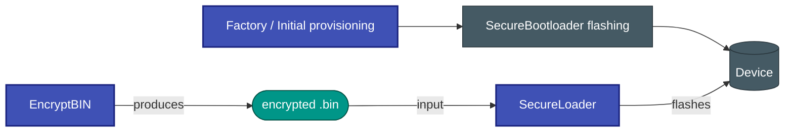

# 🔐 SecureLoader


**SecureLoader** is a cross-platform tool for uploading 🔒 AES-128 encrypted firmware
binaries to embedded devices over a serial link ⚡.
It ships with a scriptable CLI (`sld`) and a Qt6 GUI (`sld-gui`).

---

## 🚀 What is it?

SecureLoader is a cross-platform tool that allows flashing embedded devices using encrypted firmware binaries generated by [EncryptBIN](https://github.com/niwciu/EncryptBIN).

It requires that the target device is already running a compatible bootloader (e.g. **SecureBootloader** — link will be added).

SecureLoader handles the host-side flashing process: it reads encrypted `.bin` files, validates device and firmware compatibility, and streams the firmware over a serial link using a custom XOR-acknowledged protocol 📡.



**Full documentation:** [https://niwciu.github.io/SecureLoader/](https://niwciu.github.io/SecureLoader/)

> ⚠️ Documentation is under active development — expect incomplete sections.

## ⚙️ How it works

1. 🧾 **Firmware validation** — reads 48-byte header (version, product ID, CRC32)
2. 🤝 **Serial handshake** — polls device with `GET_VERSION` every 500 ms
3. 📦 **Streaming** — sends firmware page-by-page with ACK confirmation
4. 🔄 **Auto reconnect** — recovers automatically after connection loss

→ Deep dive: [Serial Protocol](https://niwciu.github.io/SecureLoader/PROTOCOL/) · [Firmware Format](https://niwciu.github.io/SecureLoader/FIRMWARE_FORMAT/) · [Architecture](https://niwciu.github.io/SecureLoader/ARCHITECTURE/)

---

## 📦 Installation

Python 3.10+ required.

### From source

```bash
git clone https://github.com/niwciu/SecureLoader.git
cd SecureLoader

pip install -e "[gui]"   # CLI + GUI
pip install -e .          # CLI only
```

---

### 🪟 Windows installer / build scripts

You can install or build SecureLoader directly from the repository using the provided scripts.

First clone the repository:

```bash
git clone https://github.com/niwciu/SecureLoader.git
cd SecureLoader
```

Then go into the install scripts directory:

```bash
cd install_scripts
```

#### 🪟 Windows

Run:

```
build.bat
```

#### 🐧 Linux / 🍎 macOS

Run:

```bash
./build.sh
```

This will:

* create a virtual environment 🧪
* install dependencies
* build CLI + GUI application ⚙️
* generate platform-specific output
* optionally create shortcuts / launchers

#### 🧹 Uninstall

To remove a local installation, use the provided uninstall script:

* Windows: `uninstall.bat`
* Linux/macOS: `uninstall.sh`

These scripts remove the virtual environment and installed artifacts.

## 📥 Releases / Downloads / Downloads

👉 [https://github.com/niwciu/SecureLoader/releases](https://github.com/niwciu/SecureLoader/releases)

Each release may include:

* 🪟 Windows `.exe` installers and portable builds
* 🐧 Ubuntu/Linux packages (`.deb` or distribution-specific package)
* 🧰 CLI standalone builds
* 🖥️ GUI builds
* 📄 release notes

> ⚠️ Some releases may be experimental or in preview state.

---

## 🧪 Usage

> ⚡ **Important:** The usage flow is split into two stages:
>
> 1. 🔐 Generate encrypted firmware (external tool)
> 2. 📡 Connect and flash using SecureLoader (CLI or GUI)

This flow is also reflected in the architecture diagram above.

---

### 🔐 Step 1 — Generate encrypted firmware

SecureLoader does NOT work with raw binaries.
You must first generate an encrypted `.bin` file using [EncryptBIN](https://github.com/niwciu/EncryptBIN):

```bash
encryptbin input.bin output.bin
```

This produces:

* AES-128 CBC encrypted firmware 🔐
* 48-byte SecureLoader header 🧾

⚠️ The target device must already be flashed with **SecureBootloader** before SecureLoader can be used.

---

### 🧰 CLI usage (single-command flow)

CLI is designed for automation — everything is done in one command:

```bash
sld flash --file firmware.bin --port COM3 --baud 115200
```

Typical flow:

1. Select encrypted firmware file
2. Provide serial port
3. Optionally set baud rate
4. Flash starts immediately
5. Tool automatically handles connect → transfer → finish → disconnect

Other useful commands:

```bash
sld list-ports
sld info --file firmware.bin
sld info --port COM3
```

---

### 🖥️ GUI usage (interactive flow)

GUI is designed for manual control and visibility:

1. 🚀 Launch application

```bash
sld-gui
```

2. ⚙️ Select:

   * Serial port
   * Baud rate

3. 📂 Load encrypted `.bin` file

4. 🤝 Click **Connect**

   * Establishes handshake with device
   * Validates firmware compatibility

5. 📡 Click **Update / Flash**

   * Streams firmware page-by-page
   * Shows live progress

6. 🔌 Click **Disconnect** (or automatic after completion)

---

### 🔄 Connection lifecycle

Both CLI and GUI follow the same internal state machine:

CONNECTING → HANDSHAKE → TRANSFER → VERIFY → DISCONNECT

---

## 🔧 Firmware generation

Uses [EncryptBIN](https://github.com/niwciu/EncryptBIN) to generate:

* AES-128 CBC encrypted firmware 🔐
* 48-byte SecureLoader header 🧾

---

## 🤝 Contributing

We welcome contributions! Please follow the workflow below:

### 🧭 Contribution workflow

1. 🍴 **Fork the repository** on GitHub

2. 📥 **Clone your fork**

```bash
git clone https://github.com/<your-username>/SecureLoader.git
cd SecureLoader
```

3. 🧪 **Install development environment**

```bash
pip install -e "[gui,dev]"
```

4. 🔄 **Create a new branch for your changes**

```bash
git checkout -b feature/my-change
```

5. 🧷 **Make your changes**

6. 🧪 **Run tests and checks locally**

```bash
pytest
ruff check src tests
mypy src
black src tests
flake8 src tests
```

7. 🚀 **Push changes to your fork**

```bash
git push origin feature/my-change
```

8. ✅ **Ensure CI passes** on your fork / PR

9. 🔁 **Open a Pull Request**

* Describe your changes clearly
* Link related issues if applicable

---

## 📚 Documentation

Full documentation is hosted at:
[https://niwciu.github.io/SecureLoader/](https://niwciu.github.io/SecureLoader/)

> ⚠️ Documentation is currently under active development.
> Some sections may be incomplete or subject to change.

| Page                                                                      | Contents                                                    |
| ------------------------------------------------------------------------- | ----------------------------------------------------------- |
| [User Guide](https://niwciu.github.io/SecureLoader/USER_GUIDE/)           | Installation, CLI reference, GUI walkthrough, configuration |
| [Firmware Format](https://niwciu.github.io/SecureLoader/FIRMWARE_FORMAT/) | Binary header layout, field semantics, wire vs. disk format |
| [Serial Protocol](https://niwciu.github.io/SecureLoader/PROTOCOL/)        | Command set, timing, state machine, bootloader requirements |
| [Architecture](https://niwciu.github.io/SecureLoader/ARCHITECTURE/)       | Layer design, module responsibilities, threading model      |
| [Contributing](https://niwciu.github.io/SecureLoader/CONTRIBUTING/)       | Dev setup, testing, code style, adding sources / languages  |
| [Troubleshooting](https://niwciu.github.io/SecureLoader/TROUBLESHOOTING/) | Common errors and fixes                                     |

To preview docs locally:

```bash
pip install mkdocs mkdocs-material pymdown-extensions
mkdocs serve          # http://127.0.0.1:8000
```

## 📄 License

MIT ©
