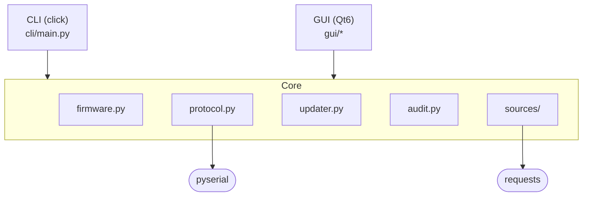
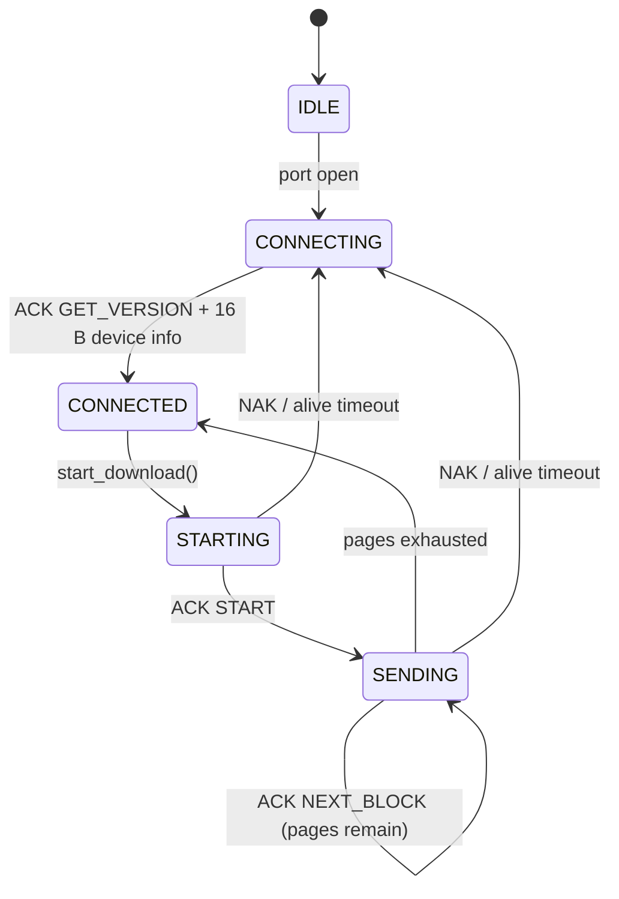

# 🏗️ Architecture — Current State

This document describes how the application is organised *today*. For the
roadmap on adding GitHub Releases firmware downloads, see
[GITHUB_SOURCE_MIGRATION.md](GITHUB_SOURCE_MIGRATION.md).

## 📋 Table of Contents

1. [Layers](#-layers)
2. [Dependency Diagram](#-dependency-diagram)
3. [Core — Domain](#-core--domain)
4. [CLI](#-cli)
5. [GUI](#-gui)
6. [Configuration](#-configuration)
7. [Internationalisation](#-internationalisation)
8. [Threading Model](#-threading-model)
9. [Firmware Format and Protocol](#-firmware-format-and-protocol)
10. [Tests](#-tests)
11. [Packaging and Distribution](#-packaging-and-distribution)

---

## 🧩 Layers

The project is split into **three layers** that can be developed independently:

| Layer | Location | Dependencies | Purpose |
|-------|----------|-------------|---------|
| **Core** | [src/secure_loader/core/](https://github.com/niwciu/SecureLoader/tree/main/src/secure_loader/core/) | `pyserial`, `requests` | Domain logic. Knows nothing about Qt or the CLI. |
| **CLI** | [src/secure_loader/cli/](https://github.com/niwciu/SecureLoader/tree/main/src/secure_loader/cli/) | Core + `click` | Console entry point. |
| **GUI** | [src/secure_loader/gui/](https://github.com/niwciu/SecureLoader/tree/main/src/secure_loader/gui/) | Core + `PySide6` | Qt6 frontend. Optional (`[gui]` extra). |

Additional shared modules:
- [config.py](https://github.com/niwciu/SecureLoader/blob/main/src/secure_loader/config.py) — per-user configuration.
- [i18n/](https://github.com/niwciu/SecureLoader/tree/main/src/secure_loader/i18n/) — translations.
- [core/audit.py](https://github.com/niwciu/SecureLoader/blob/main/src/secure_loader/core/audit.py) — rotating flash-attempt audit log.

**Rule:** core NEVER imports from CLI or GUI. CLI and GUI call core.

---

## 📊 Dependency Diagram



---

## ⚙️ Core — Domain

Five modules encapsulating all business logic.

### `core/firmware.py`

**Responsibility:** parsing the `.bin` binary format.

Key objects:
- `HEADER_SIZE = 48` — total header size on disk.
- `DEVICE_HEADER_SIZE = 44` — header size sent to the device
  (without the `prevAppVersion` field).
- `FirmwareHeader` — dataclass with fields and helpers (`format_product_id`,
  `license_id`, `unique_id`, `payload_size`).
- `parse_header(bytes) -> FirmwareHeader` — parses the first 48 bytes.
- `load_firmware(path) -> (FirmwareHeader, bytes)` — parses from file.
- `build_device_header(bytes) -> bytes` — strips `prevAppVersion` before
  transmission.
- `split_pages(payload, page_size) -> list[bytes]` — splits payload into
  equal pages; an incomplete final page is dropped (matching C++ behaviour).

All numbers are little-endian. `productId` is 64-bit assembled as
`MSB << 32 | LSB`.

### `core/protocol.py`

**Responsibility:** communication with the bootloader over a serial port.

Exposed API:
- `Protocol(port, parity, callbacks)` — high-level driver.
- `ProtocolCallbacks` — hooks (`on_state_changed`, `on_device_info`,
  `on_error`, `on_page_sent`, `on_download_done`).
- `State` — state enum (`IDLE`, `CONNECTING`, `CONNECTED`, `STARTING`,
  `SENDING`).
- `Command` — protocol commands (`GET_VERSION = 0x01`, `START = 0x02`,
  `NEXT_BLOCK = 0x03`, `RESET = 0x04`).
- `DeviceInfo` — 16-byte response from `GET_VERSION`.
- `Parity` — parity enum, `Parity.from_label()` accepts GUI labels
  (`"None"`, `"Odd"`, `"Even"`).

**State machine:**



**The driver is synchronous.** The `run()` method blocks. The consumer
decides whether to run it in `threading.Thread` (CLI) or `QThread` (GUI).
No built-in event loop — deliberate: a separate driver does not inherit
from `QObject`, so core does not pull in PySide6.

### `core/sources/`

**Responsibility:** firmware source abstraction.

```
sources/
├── base.py        — FirmwareSource (ABC), FirmwareIdentifier, exceptions
├── local.py       — read from disk
├── http.py        — HTTP server download (HTTPS by default; allow_insecure opt-in)
└── github.py      — GitHub Releases scaffold (see roadmap)
```

Contract:

```python
class FirmwareSource(ABC):
    def fetch_latest(self, identifier, progress=None) -> bytes: ...
    def fetch_previous(self, identifier, progress=None) -> bytes: ...
```

`FirmwareIdentifier` carries `license_id`, `unique_id`, optionally
`app_version` (used by `fetch_previous`).

`FirmwareSource` is used by the network-fetch paths only: the CLI `fetch` command
and the GUI _Fetch from server_ / _Get Previous Firmware_ buttons both use
`HttpFirmwareSource`. The CLI `flash` command and the GUI _Select file_ path read
local files directly via `load_firmware()` — they do not go through `LocalFirmwareSource`.
`GithubReleasesFirmwareSource` is scaffolding only and is not wired to any frontend yet
(see [roadmap](GITHUB_SOURCE_MIGRATION.md)).

### `core/audit.py`

**Responsibility:** recording every flash attempt for later review.

`log_flash(port, fw_version, outcome)` appends a timestamped entry to a rotating log
file in the platform config directory (e.g. `~/.config/secureloader/audit.log` on
Linux). Rotation: 1 MB per file, 5 backups kept. Both the CLI `flash` command and any
future GUI flash path call this function.

### `core/updater.py`

A single function: `check_device_matches_firmware(device, firmware)`
returns `MismatchReason` (falsy on success). Allows writing:

```python
if (reason := check_device_matches_firmware(dev, fw)):
    raise IncompatibleError(reason.describe())
```

---

## 💻 CLI

File: [cli/main.py](https://github.com/niwciu/SecureLoader/blob/main/src/secure_loader/cli/main.py).

Based on [Click](https://click.palletsprojects.com/). Entry points defined
in [pyproject.toml](https://github.com/niwciu/SecureLoader/blob/main/pyproject.toml):

```toml
[project.scripts]
sld = "secure_loader.cli.main:cli"
```

Structure:

```
sld                      # Root group
├── list-ports            # List serial ports
├── info                  # Info about .bin and/or device
├── fetch                 # Download from HTTP source → save to file (HTTPS; --allow-insecure opt-in)
├── flash                 # Full update: .bin + port → device; writes audit log entry
└── config                # Config file operations
    ├── path
    ├── show
    ├── set
    └── set-password      # Secure interactive password prompt
```

Every command has `--help`. Global flags: `-v/-vv`, `--language`.

The `flash` command flow shows how CLI uses core without Qt:

1. `load_firmware(path)` → header + bytes.
2. `Protocol(...)` with `ProtocolCallbacks` mapped to `click.echo`.
3. Driver started in `threading.Thread(target=proto.run)`.
4. Wait for `on_device_info` (synchronised via `threading.Event`).
5. `check_device_matches_firmware()`.
6. `proto.start_download(fw)` → `proto.wait_for_download()`.
7. `proto.stop()` + `thread.join()`.

---

## 🖥️ GUI

Files: [gui/](https://github.com/niwciu/SecureLoader/tree/main/src/secure_loader/gui/).

```
gui/
├── app.py           — QApplication bootstrap, icon, language
├── main_window.py   — QMainWindow reproducing mainwindow.ui 1:1
├── login_dialog.py  — QDialog for HTTP credentials (saves to config.ini)
└── workers.py       — ProtocolWorker, DownloadWorker (QThread wrappers)
```

### View ↔ Logic Relationship

The GUI does **not** use `.ui` files (Designer). The layout is built
programmatically in `main_window.py::_build_ui()`, exactly reproducing
the grid coordinates from the original `mainwindow.ui`. This is a
deliberate trade-off:

- **+** no `.ui` → `_ui.py` compilation step (fewer tools in CI)
- **+** layout under version control as code
- **−** cannot be edited in Qt Designer

If visual editing is ever needed, a `.ui` file can be created in Designer
and `_build_ui` replaced with `self.ui = Ui_MainWindow(); self.ui.setupUi(self)`.

### Workers = QThread Wrappers

`workers.py` contains no business logic. Each worker is a `QObject`
with a `run()` method and Qt signals that *wraps* core:

```python
class ProtocolWorker(QObject):
    state_changed = Signal(State)
    device_info   = Signal(DeviceInfo)
    ...
    @Slot()
    def run(self):
        callbacks = ProtocolCallbacks(
            on_state_changed=self.state_changed.emit,
            ...
        )
        self._proto = Protocol(port, parity, callbacks=callbacks)
        self._proto.connect()
        self._proto.run()  # blocking loop
```

`start_in_thread(worker)` creates a `QThread`, calls `moveToThread`,
connects `started → run`, `finished → quit/deleteLater`, and starts.

Qt signals are automatically queued across threads, so UI updates from
a worker are safe.

### Core Integration

`MainWindow._connect_serial()`:

```python
self._protocol_worker = ProtocolWorker(port, parity)
self._protocol_worker.state_changed.connect(self._on_state_changed)
self._protocol_worker.device_info.connect(self._on_device_info)
self._protocol_worker.error_occurred.connect(self._on_protocol_error)
self._protocol_worker.page_sent.connect(self._on_page_sent)
self._protocol_worker.download_done.connect(self._on_download_done)
self._protocol_thread = start_in_thread(self._protocol_worker, parent=self)
```

Signals → slots are `Qt::QueuedConnection` (different threads). `MainWindow`
never touches the serial port directly.

---

## 🔧 Configuration

File: [config.py](https://github.com/niwciu/SecureLoader/blob/main/src/secure_loader/config.py).

Format: INI (`configparser`).

Location (via `platformdirs`):

| OS | Path |
|----|------|
| Linux | `~/.config/secureloader/config.ini` |
| Windows | `%APPDATA%\secureloader\config.ini` |
| macOS | `~/Library/Application Support/secureloader/config.ini` |

Structure:

```ini
[http]
base_url = 
login = 
password = 

[ui]
language = auto
instruction_url = 

[recent]
firmware_0 = /path/to/last.bin
firmware_1 = /path/to/prev.bin
```

Fields:
- `http.base_url` — base URL for the HTTP firmware server. Must start with `https://`; plain
  `http://` raises `FirmwareSourceError` unless `allow_insecure=True` is passed explicitly.
- `http.login` / `http.password` — optional HTTP Basic Auth credentials.
  When both are empty, authentication is skipped. Stored in the OS keychain when the
  `[security]` extra (`keyring`) is installed; otherwise in plaintext with `chmod 0600` on Unix.
- `ui.language` — `"auto" | "en" | "de" | "fr" | "es" | "it" | "pl"`.
- `ui.instruction_url` — optional URL opened by the _Update instruction…_ GUI
  menu item. When empty, the menu item is hidden.
- `recent.firmware_N` — recently opened files (max 10).

Writes are *atomic* (`.tmp` + `os.replace`) and set `chmod 0600` on Unix.

---

## 🌍 Internationalisation

File: [i18n/__init__.py](https://github.com/niwciu/SecureLoader/blob/main/src/secure_loader/i18n/__init__.py).

Ultra-lightweight solution without `gettext` or compiled `.mo` files: a
`TRANSLATIONS` dictionary in Python, and a `_(msgid, **kwargs)` function.

**Why not gettext?**
- Small string set (~50 entries).
- No dependency on `msgfmt` on Windows build agents.
- `_()` is a plain Python function — easy to test, easy to add a new
  language (edit the dict, no compilation step).

**Supported languages:** English (`en`), German (`de`), French (`fr`),
Spanish (`es`), Italian (`it`), Polish (`pl`).

**Language detection:** `LC_ALL` / `LC_MESSAGES` / `LANG` / `LANGUAGE`
env vars, fallback to `locale.getlocale()`, final fallback `"en"`.

**Runtime switch:** `set_language("pl")`. `set_language("auto")` triggers
detection. The GUI switches immediately without restart via `_retranslate_ui()`.

Adding a new language = append a key to `TRANSLATIONS` and add it to
`SUPPORTED`.

---

## 🧵 Threading Model

| Context | Main thread | Worker threads |
|---------|------------|---------------|
| CLI | `click` + orchestration | `Thread(target=proto.run)` — serial driver |
| GUI | Qt event loop | `QThread(ProtocolWorker)` — serial driver; `QThread(DownloadWorker)` — HTTP download |

**Rules:**
1. Core does not create threads. The consumer decides.
2. `Protocol` is *not* reentrant — one instance per connection, one
   thread drives it.
3. Callbacks in `ProtocolCallbacks` are invoked from the driver thread.
   The consumer is responsible for marshalling (Qt signals do this
   automatically; CLI does not need it because `click.echo` is
   thread-safe).
4. `Protocol.stop()` sets a `threading.Event` — the driver thread exits
   on the next loop iteration.

---

## 📡 Firmware Format and Protocol

> Full details are in the dedicated reference documents:
> [Firmware Format](FIRMWARE_FORMAT.md) · [Serial Protocol](PROTOCOL.md)

### `.bin` Header (48 B, little-endian)

```
offset  size  field
   0     4    protocolVersion
   4     4    productId (MSB)
   8     4    productId (LSB)
  12     4    appVersion
  16     4    prevAppVersion     ← stripped before sending to device
  20     4    pageCount
  24     4    flashPageSize
  28    16    IV
  44     4    crc32
  48     …    encrypted pages
```

Wire header = bytes `[0:16] + [20:48]` = 44 B (sent with the `START` command).

### Serial Commands (1 byte each)

| Name | Value | Direction |
|------|-------|----------|
| `GET_VERSION` | `0x01` | host → device |
| `START` | `0x02` | host → device |
| `NEXT_BLOCK` | `0x03` | host → device |
| `RESET` | `0x04` | host → device |
| ACK | `cmd XOR 0x40` | device → host |
| NAK | `cmd XOR 0x80` | device → host |

After ACK for `GET_VERSION` the device sends 16 bytes of device info
(`u32 bootloaderVersion`, `u64 productId`, `u32 flashPageSize`).

The host sends `START` (`0x02`) immediately followed by the 44 B wire header
as a single transmission. The device responds ACK/NAK. Then for each page the
host sends `NEXT_BLOCK` (`0x03`) + `flashPageSize` bytes, and the device ACKs.

Line parameters: `115200 8N1` (parity configurable).

Timing: `GET_VERSION` poll every 500 ms, alive timeout 10 s.

---

## 🧪 Tests

Files: [tests/](https://github.com/niwciu/SecureLoader/tree/main/tests/).

- `test_firmware.py` — header parser, `build_device_header`, `split_pages`.
- `test_protocol.py` — state machine, tested by injecting bytes into
  `_handle_byte()` (no pyserial mocking).
- `test_updater.py` — `check_device_matches_firmware`.
- `test_config.py` — config load/save and keyring integration.
- `test_http_source.py` — `HttpFirmwareSource`: URL encoding, TLS enforcement,
  auth passthrough, 100 MB download cap, version string validation.
- `test_local_source.py` — `LocalFirmwareSource`.
- `test_github_source.py` — `GithubReleasesFirmwareSource` with mocked GitHub API.
- `test_cli.py` — CLI commands: `config set/show/path`, `fetch` (HTTP rejection,
  `--allow-insecure` passthrough), flash confirmation flow.
- `test_cli_flash.py` — `flash` command integration test (Protocol mocked; verifies
  audit log entry written on success and error).
- `test_audit.py` — audit log format and rotation.
- `test_gui.py` — GUI smoke tests (uses `QT_QPA_PLATFORM=offscreen`).
- `conftest.py` — `sample_header_bytes` and `sample_firmware` fixtures.

Coverage gate: **70 %** (enforced in CI with `--cov-fail-under=70`).

Run:

```bash
pip install -e ".[gui,dev]"
QT_QPA_PLATFORM=offscreen pytest --cov=src/secure_loader --cov-fail-under=70 -v
ruff check .
mypy src
bandit -r src/ -ll -x src/secure_loader/gui/resources
pip-audit --skip-editable
```

---

## 📦 Packaging and Distribution

`pyproject.toml` defines:

- `[project.scripts]` — `secure-loader`, `sld`, `sloader`
- `[project.gui-scripts]` — `sld-gui`, `secure-loader-gui`, `sloader-gui`
- Extras: `[gui]` (PySide6), `[security]` (keyring — OS credential store),
  `[dev]` (pytest, ruff, mypy, black, flake8, bandit, pip-audit),
  `[build]` (pyinstaller).

### Building a Wheel

```bash
pip install build
python -m build        # dist/*.whl
```

### Building a Standalone Executable

```bash
pip install -e ".[build]"
```

**Linux / macOS:**

```bash
pyinstaller \
    --name="sld-gui" \
    --icon=src/secure_loader/gui/resources/icons/icon.png \
    --windowed \
    --onefile \
    -p src \
    src/secure_loader/gui/app.py
```

**Windows:**

```bat
pyinstaller ^
    --name="sld-gui" ^
    --icon=src/secure_loader/gui/resources/icons/icon.ico ^
    --windowed ^
    --onefile ^
    -p src ^
    src/secure_loader/gui/app.py
```

The resulting binary is placed in `dist/`. Alternatively, use the provided
`install_scripts/build.sh` (Linux/macOS) or `install_scripts/build.bat`
(Windows) which set up a virtual environment and run PyInstaller automatically.

### Cross-platform

- `pyserial` handles Linux/Windows/macOS automatically.
- `platformdirs` resolves config paths.
- `PySide6` has binary wheels for all platforms.
- The only platform-specific code: `os.chmod(0o600)` in `save_config` is
  a no-op on Windows (silent `except OSError`).
