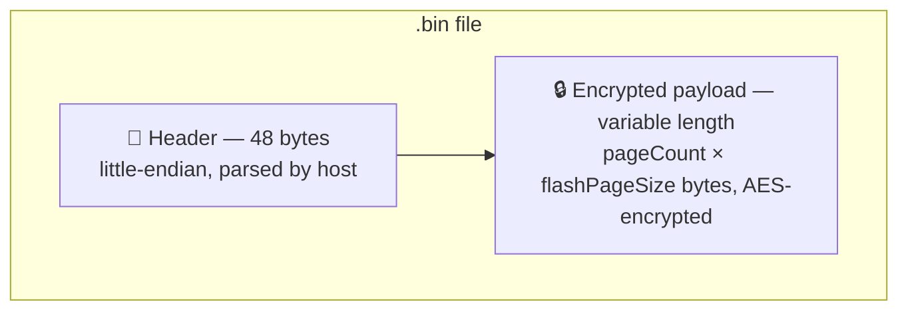
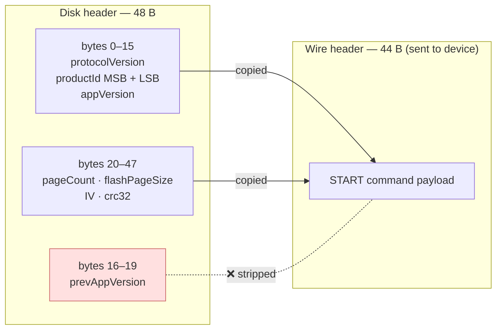
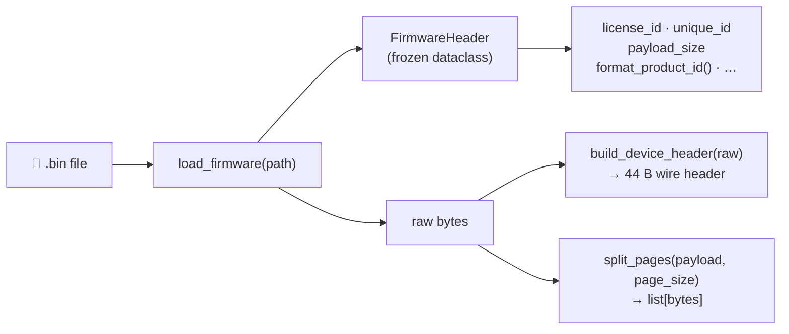

# 📦 Firmware Format

This document specifies the binary layout of `.bin` firmware files consumed by
SecureLoader. Bootloader and firmware build toolchain authors should refer to
this document to ensure compatibility.

Host implementation: [`src/secure_loader/core/firmware.py`](https://github.com/niwciu/SecureLoader/blob/main/src/secure_loader/core/firmware.py).

---

## 📋 Table of Contents

1. [Overview](#-overview)
2. [Header Layout (48 B)](#-header-layout-48-b)
3. [Field Semantics](#-field-semantics)
4. [productId Derived Fields](#-productid-derived-fields)
5. [Wire Header (44 B)](#-wire-header-44-b)
6. [Payload](#-payload)
7. [Host Parsing API](#-host-parsing-api)

---

## 🗂️ Overview

A `.bin` file consists of a **48-byte little-endian header** immediately followed
by the **encrypted payload** (the application image). No alignment padding exists
between the header and the payload.



---

## 🔢 Header Layout (48 B)

| Offset | Size | Type | Field |
|-------:|-----:|------|-------|
| 0 | 4 | u32 | `protocolVersion` |
| 4 | 4 | u32 | `productId` (MSB) |
| 8 | 4 | u32 | `productId` (LSB) |
| 12 | 4 | u32 | `appVersion` |
| 16 | 4 | u32 | `prevAppVersion` |
| 20 | 4 | u32 | `pageCount` |
| 24 | 4 | u32 | `flashPageSize` |
| 28 | 16 | bytes | `IV` (Initialization Vector) |
| 44 | 4 | u32 | `crc32` |
| **48** | — | — | *start of encrypted payload* |

All integer fields are **unsigned, little-endian**.

---

## 🔍 Field Semantics

### `protocolVersion` (u32)

Version of the bootloader communication protocol. The host compares this
field against the `bootloaderVersion` reported by the device at connect time.
The values must be **identical** — there is no backwards compatibility;
a mismatch prevents flashing. Increment this field only when the wire header
format or command semantics change.

### `productId` (u64, stored as two u32)

64-bit product/unit identifier. Stored on disk as two consecutive 32-bit
fields (MSB first):

```
productId = (productId_MSB << 32) | productId_LSB
```

The host assembles the 64-bit value and compares it against the device's
`productId` from the `GET_VERSION` response. A mismatch prevents flashing
(unless `--force` is used).

### `appVersion` (u32)

Version of the application image. Displayed in the GUI and CLI for
informational purposes. Not validated by the bootloader protocol.

### `prevAppVersion` (u32)

Version of the previous application image. Used by the host to request an
older firmware from the HTTP source (`fetch_previous`).
GitHub Releases support is planned — see [Roadmap](GITHUB_SOURCE_MIGRATION.md).
This field is **not** sent to the device — see [Wire Header](#-wire-header-44-b).

### `pageCount` (u32)

Number of flash pages in the payload. Transmitted to the device inside the
wire header — the **device** uses this value to count received pages and detect
when the transfer is complete.

The host drives its send loop by exhausting the payload bytes, not by reading
this field. For correctly built firmware, `len(payload) / device_page_size == pageCount`
holds true and the two perspectives agree.

### `flashPageSize` (u32)

Size of one flash page in bytes. The device reports its own `flashPageSize`
in the `GET_VERSION` response. The host uses the **device's** reported value
for payload segmentation — this header field is informational on the host side.
If the device reports `0`, the host falls back to `1024` bytes.

### `IV` (16 bytes)

AES Initialization Vector for the encrypted payload. Sent to the device
inside the wire header (bytes 28–43). The specific encryption algorithm and
key management are outside the scope of this document and are defined by the
firmware build toolchain ([EncryptBIN](https://github.com/niwciu/EncryptBIN)).

### `crc32` (u32)

CRC32 checksum of the encrypted payload. The device verifies this after
receiving all pages. If verification fails, the device stays in bootloader
mode and the host must retry.

---

## 🔑 productId Derived Fields

The 16-hex-digit representation of `productId` (zero-padded, uppercase) is
used to derive two short identifiers:

```
productId hex:  A A B B C C D D 1 1 2 2 3 3 4 4
index:          0 1 2 3 4 5 6 7 8 9 10 11 12 13 14 15

licenseId = hex[4:6]    →  "CC"
uniqueId  = hex[12:16]  →  "3344"
```

These identifiers are used to construct the URL path on the HTTP firmware server:

```
{base_url}/{licenseId}/{uniqueId}/info.txt      ← plain-text version tag
{base_url}/{licenseId}/{uniqueId}/{version}.bin ← firmware binary
```

See [User Guide — HTTP server requirements](USER_GUIDE.md#-http-server-requirements)
for the full fetch workflow.

---

## 📡 Wire Header (44 B)

The header that the device receives during a firmware update is **not** the
full 48-byte disk header. The `prevAppVersion` field (bytes 16–19) is
stripped before transmission.



Expressed as a slice operation:

```
wire_header = disk_header[0:16] + disk_header[20:48]
            = protocolVersion + productId (MSB+LSB) + appVersion
              + pageCount + flashPageSize + IV + crc32
```

This 44-byte block is the payload of the `START` command.

---

## 📦 Payload

The payload immediately follows the 48-byte header at offset 48. It consists
of `pageCount` pages of `flashPageSize` bytes each:

```
total_payload_size = pageCount × flashPageSize
```

If the raw binary has trailing bytes beyond `pageCount × flashPageSize`,
they are **silently ignored** — the host's `split_pages` uses integer division
so a partial final page is never transmitted.

---

## 🐍 Host Parsing API



```python
from secure_loader.core.firmware import (
    parse_header,          # parse_header(data: bytes) -> FirmwareHeader
    load_firmware,         # load_firmware(path) -> (FirmwareHeader, bytes)
    build_device_header,   # build_device_header(raw: bytes) -> bytes  (44 B)
    split_pages,           # split_pages(payload, page_size) -> list[bytes]
)
```

`FirmwareHeader` is a frozen dataclass exposing all fields plus helpers:
`license_id`, `unique_id`, `payload_size`, `format_product_id()`, etc.

`FirmwareFormatError` (subclass of `ValueError`) is raised when the data is
too short or otherwise unparseable.
