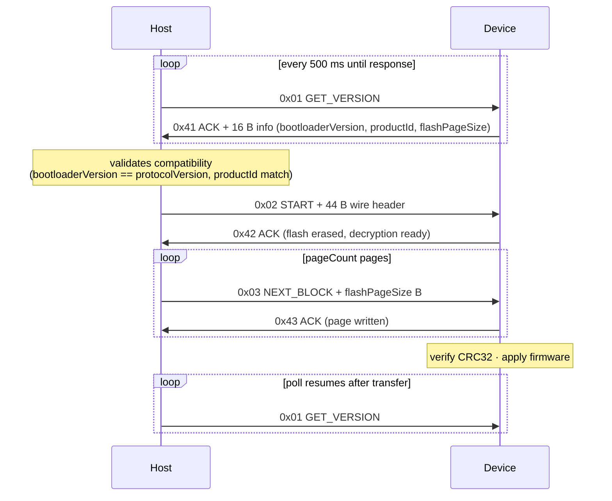
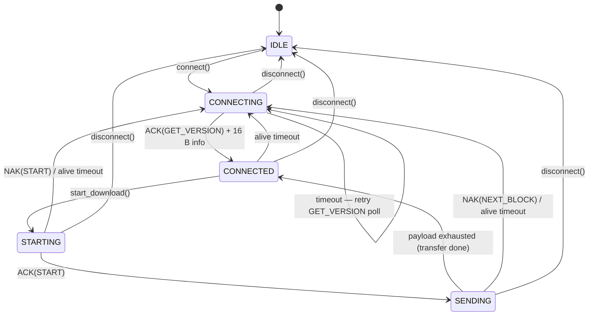
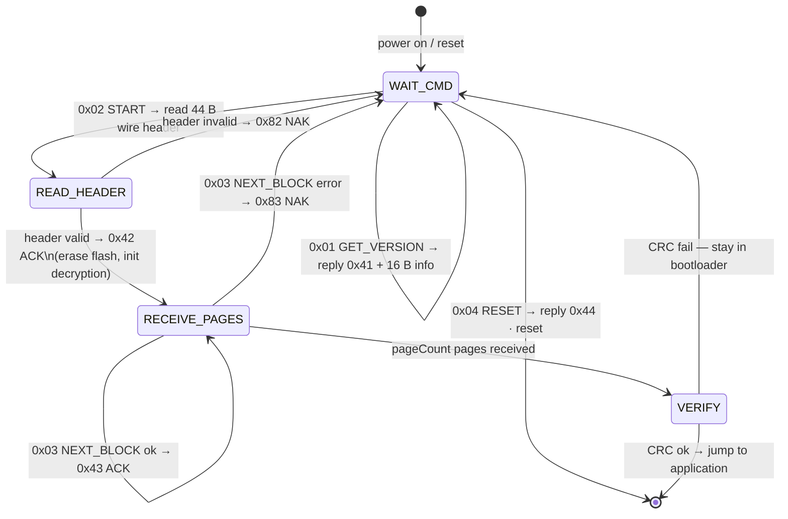

# 📡 Serial Protocol Specification

Reference document for **bootloader authors** and device integrators.
Describes the protocol that the host application implements — the device
must behave according to this document to be updatable with SecureLoader.

Host implementation: [`src/secure_loader/core/protocol.py`](https://github.com/niwciu/SecureLoader/blob/main/src/secure_loader/core/protocol.py).

---

## 📋 Table of Contents

1. [Line Parameters](#️-line-parameters)
2. [Framing and Commands](#-framing-and-commands)
3. [Commands — Details](#-commands--details)
4. [Update Sequence](#-update-sequence)
5. [Timing](#️-timing)
6. [Error Handling](#️-error-handling)
7. [Host State Machine](#-host-state-machine)
8. [Device State Machine](#-device-state-machine)
9. [Bootloader Requirements](#-bootloader-requirements)
10. [Compatibility and Versioning](#-compatibility-and-versioning)

---

## ⚙️ Line Parameters

| Parameter | Value |
|-----------|-------|
| Baud rate | `115200` (default, configurable) |
| Data bits | `8` |
| Stop bits | `1` (default, configurable) |
| Parity | `None` (default), `Odd`, `Even` — configurable |
| Flow control | none |
| Endianness | little-endian (all multi-byte fields) |

The host sets parity and stop bits according to the `--parity` / `--stopbits`
CLI arguments or the GUI dropdowns. The device must support at least one parity
mode (typically `None`).

---

## 🔤 Framing and Commands

Communication is **frameless** (byte-stream). Each command is a single byte;
additional data follows in agreed-upon fixed sizes — no length prefix, no
delimiter.

### Command Codes (host → device)

| Name | Code | Payload | Meaning |
|------|------|---------|---------|
| `GET_VERSION` | `0x01` | — | Request device info |
| `START` | `0x02` | 44 B wire header | Begin firmware transfer |
| `NEXT_BLOCK` | `0x03` | `flashPageSize` B | One payload page |
| `RESET` | `0x04` | — | Soft-reset the device |
| `NONE` | `0x00` | — | Reserved, unused |

### ACK / NAK Encoding (device → host)

The device responds with a single byte derived from the command code by XOR:

| Type | Rule | Examples |
|------|------|---------|
| ✅ ACK (success) | `cmd XOR 0x40` | `0x01` → `0x41` · `0x02` → `0x42` · `0x03` → `0x43` |
| ❌ NAK (error) | `cmd XOR 0x80` | `0x01` → `0x81` · `0x02` → `0x82` · `0x03` → `0x83` |

One rule covers all commands — no translation table needed on either side.

---

## 📖 Commands — Details

### `GET_VERSION` (`0x01`)

**Host sends:** `0x01` — polled every 500 ms until the device responds.

**Device responds:** `0x41` (ACK), then a **16-byte device info block**
(little-endian):

| Offset | Size | Type | Field |
|-------:|-----:|------|-------|
| 0 | 4 | u32 | `bootloaderVersion` |
| 4 | 8 | u64 | `productId` |
| 12 | 4 | u32 | `flashPageSize` |

**Field meanings:**

- `bootloaderVersion` — must equal `protocolVersion` in the firmware header;
  mismatch prevents flashing (no backward compatibility).
- `productId` — 64-bit identifier. Characters `hex[4:6]` of its 16-digit hex
  representation form `licenseId`; characters `hex[12:16]` form `uniqueId`
  (see [Firmware Format — productId Derived Fields](FIRMWARE_FORMAT.md#-productid-derived-fields)).
- `flashPageSize` — size of one flash page in bytes. The host uses this value
  to segment the payload. When `0`, the host falls back to `1024`.

> **Note:** the host never sends NAK (`0x81`) for `GET_VERSION` in the current implementation.

---

### `START` (`0x02`)

**Host sends:** `0x02`, then the **44-byte wire header**
(see [Firmware Format — Wire Header](FIRMWARE_FORMAT.md#-wire-header-44-b)).

**Device responds:**

- `0x42` ✅ ACK — ready for `NEXT_BLOCK`. The device has erased the required
  flash sectors and initialised decryption / CRC state.
- `0x82` ❌ NAK — error (e.g. mismatched `productId`, flash erase failed,
  invalid IV). The host reports the error and returns to `CONNECTING`.

---

### `NEXT_BLOCK` (`0x03`)

**Host sends:** `0x03`, then exactly `flashPageSize` bytes of the current page.

**Device responds:**

- `0x43` ✅ ACK — page decrypted and written; host sends next page (or stops
  when payload is exhausted).
- `0x83` ❌ NAK — write / decryption error. The host aborts the transfer.

The host ends the transfer **implicitly**: after the last page is ACKed, the
host transitions back to `CONNECTED` without sending any "end" command. The
device detects the end when it has received `pageCount` pages (from the wire
header), then verifies the CRC and applies the firmware.

---

### `RESET` (`0x04`)

**Host sends:** `0x04`.

**Device responds:** `0x44` ✅ ACK, then immediately resets.

> **Note:** the current host implementation **does not issue** `RESET`. The
> command is reserved in the enum for future use (e.g. force-reboot after
> an update). Bootloaders should implement it defensively.

---

## 🔄 Update Sequence

Full message exchange during a successful firmware update (retransmitted polls omitted):

---

## ⏱️ Timing

| Parameter | Value | Source |
|-----------|-------|--------|
| `GET_VERSION` poll interval | 500 ms | `POLL_INTERVAL_S = 0.5` |
| Alive timeout | 10 000 ms | `ALIVE_TIMEOUT_S = 10.0` |
| Host write timeout | 2 000 ms | `Serial(write_timeout=2.0)` |
| Host read timeout | 50 ms | `Serial(timeout=0.05)` |
| Default `flashPageSize` fallback | 1 024 B | `DEFAULT_PAGE_SIZE = 1024` |

**Alive timeout:** if the host receives no bytes for `ALIVE_TIMEOUT_S` while
in `CONNECTED`, `STARTING`, or `SENDING`, it drops back to `CONNECTING` and
restarts `GET_VERSION` polling. The device must therefore respond to successive
polls even while flash erase is in progress. If erase takes longer than 10 s,
respond NAK to buy time or reduce the flash page size.

**Write timeout:** if the device does not consume data fast enough (UART
backpressure), `pyserial` raises an exception after 2 s and the host disconnects.

---

## ⚠️ Error Handling

### Host side

| Situation | Host action |
|-----------|-------------|
| Unknown / stray byte in stream | Ignored — framing is state-driven, no resync needed |
| NAK on `START` or `NEXT_BLOCK` | Logs error, emits `on_error` callback, returns to `CONNECTING` |
| Alive timeout | Returns to `CONNECTING`, restarts polling |
| Serial write exception | Stops loop, reports error, disconnects |

### Device side (recommendations)

- On transfer error (bad CRC, flash write refused): send NAK and **return to
  bootloader state**, ready for a new `START`. Do not reboot — the host will
  perform a fresh handshake.
- On unexpected bytes: respond with the NAK matching the expected command in
  the current state, or remain silent.

---

## 🤖 Host State Machine

> `STARTING` and `SENDING` both show as **"Download"** in the GUI status field.

---

## 🔧 Device State Machine

Recommended state machine for a compatible bootloader:

The bootloader maintains a received-page counter. After `pageCount` pages
(from the wire header) are received, it verifies the overall CRC32, then
typically jumps to the new application. At that point the host should see a
new `bootloaderVersion` / `productId` on the next `GET_VERSION` (if the
bootloader still listens after reset).

---

## ✅ Bootloader Requirements

Minimum requirements for a compatible device:

1. **UART:** 115200 8N1 (optionally configurable parity / stop bits).
2. **Commands:** responds to `0x01`, `0x02`, `0x03`, `0x04`.
3. **Responses:** single byte via `cmd XOR 0x40` (ACK) / `cmd XOR 0x80` (NAK).
4. **Polling:** responds to `GET_VERSION` while idle within one poll interval (500 ms).
5. **Device info:** after ACK for `GET_VERSION`, sends exactly 16 B
   (`bootloaderVersion u32` + `productId u64` + `flashPageSize u32`, little-endian).
6. **Transfer capability:**
    - erases flash for the application area,
    - decrypts each page (algorithm defined by the firmware build toolchain),
    - writes each page to flash,
    - verifies the CRC32 after all pages,
    - jumps to the new application on success, or stays in bootloader on failure.
7. **Silent:** does not send unsolicited bytes (the host ignores them, but they
   pollute debug output).

**Optional (recommended):**

- Watchdog reset of the bootloader after > 30 s with no command (safety for
  devices left in bootloader mode).

---

## 🔢 Compatibility and Versioning

The `protocolVersion` field in the firmware header must **equal**
`bootloaderVersion` from the device info response. The host compares them
for strict equality before starting the transfer:

- No semver — numbers must match exactly.
- A breaking protocol change requires bumping `protocolVersion` in both the
  bootloader and the firmware build toolchain.
- If soft compatibility is needed (e.g. minor version ignored), modify
  `check_device_matches_firmware` in
  [`core/updater.py`](https://github.com/niwciu/SecureLoader/blob/main/src/secure_loader/core/updater.py).

> **Recommendation:** treat `protocolVersion` as a monotonically increasing
> integer that changes only when the wire header format or command semantics
> change. Track the application version separately in `appVersion`.
