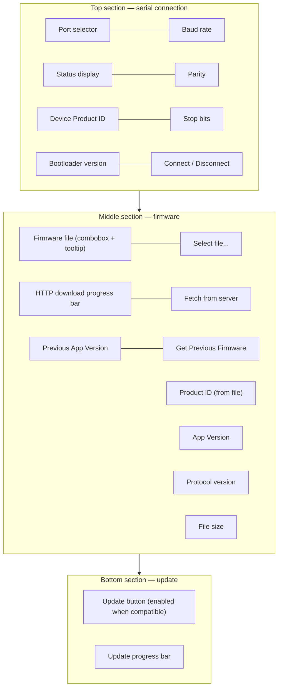

# 📖 User Guide

This page covers everything an end-user needs: installation, CLI reference, GUI walkthrough, and configuration.

---

## ✅ Prerequisites

| Requirement | Minimum version |
|-------------|----------------|
| Python | 3.10 |
| pip | 23 (recommended) |
| OS | Linux, Windows 10+, macOS 12+ |

> **📝 Note:** Python is only required for the **pip from source** installation method.
> Pre-built binaries and build-script installs have no Python dependency.

A physical serial port or USB-to-serial adapter is required to communicate with a device.

---

## 🚀 Installation

### Choose your installation method

| Method | Best for |
|--------|----------|
| 📦 [Pre-built binary](#-option-a--download-a-pre-built-binary-recommended) | End users — no Python required |
| 🐍 [pip from source](#-option-b--install-from-source-with-pip) | Python users and CI pipelines |
| 🏗️ [Build scripts](#-option-c--build-and-install-with-platform-scripts) | Native install with desktop shortcuts |

---

### 📦 Option A — Download a pre-built binary (recommended)

Go to the [**Releases page**](https://github.com/niwciu/SecureLoader/releases) and
download the package for your OS:

| Platform | Package |
|----------|---------|
| 🪟 Windows | `.exe` portable binary or installer |
| 🐧 Linux | Standalone binary or `.deb` package |
| 🍎 macOS | Standalone binary |

No Python required — download, run, and flash.

> ⚠️ Some releases may be in preview or experimental state. Check the release notes before downloading.

---

### 🐍 Option B — Install from source with pip

**Step 1 — Clone the repository:**

```bash
git clone https://github.com/niwciu/SecureLoader.git
cd SecureLoader
```

**Step 2 — Install:**

#### CLI only

```bash
pip install -e .
```

Installs the `sld`, `secure-loader`, and `sloader` entry points.

#### CLI + GUI

```bash
pip install -e ".[gui]"
```

Adds PySide6 (Qt6). Installs `sld-gui`, `secure-loader-gui`, and `sloader-gui` in addition.

#### 🔐 Security extras (optional)

```bash
pip install -e ".[security]"
```

Adds `keyring` — when installed, HTTP credentials are stored in the OS keychain (macOS Keychain,
Windows Credential Manager, or a D-Bus secret store on Linux) instead of plaintext in the INI
config file. Recommended for any installation where credentials are used.

#### 🛠️ Development setup

```bash
pip install -e ".[gui,dev]"
```

Adds pytest, ruff, mypy, black, flake8, bandit, and pip-audit.
See [Contributing](CONTRIBUTING.md) for the full development workflow, testing, and code-style guidelines.

---

### 🏗️ Option C — Build and install with platform scripts

The `install_scripts/` directory contains platform-specific scripts that build a
**standalone executable** (via PyInstaller) and register a desktop shortcut.
Python is not required on the target machine after installation.

**Step 1 — Clone the repository:**

```bash
git clone https://github.com/niwciu/SecureLoader.git
cd SecureLoader/install_scripts
```

**Step 2 — Run the build script for your platform:**

| Platform | Command |
|----------|---------|
| 🪟 Windows | `build.bat` |
| 🐧 Linux / 🍎 macOS | `./build.sh` |

The script will:

- create a virtual environment and install all dependencies
- build a standalone executable with PyInstaller
- offer a choice between **user-local** and **system-wide** installation
- install the executable and create a desktop / Start Menu shortcut

> **🪟 Windows note:** `build.bat` also attempts to self-sign the EXE with a local
> certificate to reduce SmartScreen warnings.

#### 🧹 Uninstalling

| Platform | Command |
|----------|---------|
| 🪟 Windows | `uninstall.bat` |
| 🐧 Linux / 🍎 macOS | `./uninstall.sh` |

The uninstall script removes the executable, shortcuts, and icon files.
The cloned repository folder itself is **not** removed.

---

### ✅ Verify installation

After installing via any method:

```bash
sld --version
sld-gui &
```

---

## 🖥️ CLI Reference

The primary entry point is `sld`. All three aliases (`sld`, `secure-loader`, `sloader`) are identical.

```
sld [GLOBAL OPTIONS] COMMAND [ARGS]...
```

### 🌐 Global options

Available on every command:

| Option | Description |
|--------|-------------|
| `--version` | Print version and exit. |
| `-v` / `--verbose` | Enable INFO-level logging. |
| `-vv` | Enable DEBUG-level logging (repeat the flag). |
| `--language LANG` | Override UI language. Values: `auto`, `en`, `de`, `fr`, `es`, `it`, `pl`. |

---

### `list-ports` — 🔌 List serial ports

List serial ports detected on the system.

```bash
sld list-ports
```

Output is tab-separated: `device`, `description`, `manufacturer`:

```
/dev/ttyUSB0    USB Serial Port    CP2102
/dev/ttyACM0    Arduino Mega 2560
```

---

### `info` — 🔍 Inspect firmware or device

Inspect a firmware file, query a connected device, or do both at once (compatibility check included).

```bash
# Inspect firmware header only
sld info --file firmware.bin

# Query a device
sld info --port /dev/ttyUSB0

# Both — shows header + device info + compatibility status
sld info --file firmware.bin --port /dev/ttyUSB0 --parity odd
```

| Option | Default | Description |
|--------|---------|-------------|
| `--file FILE` | — | Path to the `.bin` firmware file. |
| `--port TEXT` | — | Serial port to query. |
| `--baudrate INT` | `115200` | Baud rate. |
| `--stopbits 1\|1.5\|2` | `1` | Stop bits. |
| `--parity none\|odd\|even` | `none` | Parity. |
| `--timeout FLOAT` | `15.0` | Seconds to wait for device response. |

---

### `fetch` — ⬇️ Download firmware from server

Download a firmware binary from the configured HTTP server and save it to disk.

```bash
# Download the latest firmware for a device
sld fetch --license AB --unique C0FE --output firmware.bin

# Download a specific (previous) version
sld fetch --license AB --unique C0FE --previous 0x01020300 --output prev.bin

# Override the server URL for a one-off download (HTTPS recommended)
sld fetch --license AB --unique C0FE --output fw.bin --base-url https://myserver/update

# Allow a plain HTTP server in a controlled environment (not for production)
sld fetch --license AB --unique C0FE --output fw.bin --base-url http://myserver/update --allow-insecure
```

| Option | Description |
|--------|-------------|
| `--license TEXT` | License ID (expected: two hex characters). Required. |
| `--unique TEXT` | Unique device ID (expected: four hex characters). Required. |
| `--previous TEXT` | Fetch the version identified by this `appVersion` string instead of the latest. |
| `--output FILE` | Destination file path (required). |
| `--base-url TEXT` | Override `http.base_url` from config for this call only. |
| `--allow-insecure` | Allow plain HTTP URLs and disabled TLS verification. Use only in controlled environments. |

The license and unique IDs can be read from the device using `sld info --port ...`.

#### 🌐 HTTP server requirements

`fetch` expects your server to expose files at the following URL structure:

```
{base_url}/{license_id}/{unique_id}/info.txt
{base_url}/{license_id}/{unique_id}/{version}.bin
```

| File | Content | Required for |
|------|---------|--------------|
| `info.txt` | Plain-text version tag, e.g. `0x01020301` (one line) | `fetch` latest |
| `{version}.bin` | The encrypted firmware binary | all fetch variants |

> **⚠️ `base_url` is empty by default.** `sld fetch` will fail until you set it:
> ```bash
> sld config set http.base_url https://myserver/update
> ```
> Plain HTTP (`http://`) is **rejected by default** for security. If you must use plain
> HTTP in a controlled environment, pass `--allow-insecure` to the `fetch` command or
> configure the URL after confirming the risk.

HTTP Basic Auth is **optional**. If your server requires credentials, configure them once and they are applied automatically to every `fetch` call:

```bash
sld config set http.login myuser
sld config set-password          # secure interactive prompt — password never appears in shell history
```

Credentials are stored in the **OS keychain** when the `[security]` extra is installed
(`pip install -e ".[security]"`). Without it, credentials fall back to the INI config file
with `0600` permissions on Unix. See the [Configuration Reference](#️-configuration-reference) for details.

How `license_id` and `unique_id` are derived from the device's `productId`, and the full server path layout, is documented in [Firmware Format](FIRMWARE_FORMAT.md).

---

### `flash` — ⚡ Flash firmware to device

Flash a firmware binary to a connected device.

```bash
# Basic flash
sld flash --file firmware.bin --port /dev/ttyUSB0

# Non-default serial settings
sld flash --file firmware.bin --port COM3 --parity odd --baudrate 115200

# Skip compatibility check (use with caution — may brick the device)
sld flash --file firmware.bin --port /dev/ttyUSB0 --force
```

| Option | Default | Description |
|--------|---------|-------------|
| `--file FILE` | — | Path to the `.bin` firmware file (required). |
| `--port TEXT` | — | Serial port (required). |
| `--baudrate INT` | `115200` | Baud rate. |
| `--stopbits 1\|1.5\|2` | `1` | Stop bits. |
| `--parity none\|odd\|even` | `none` | Parity. |
| `--timeout FLOAT` | `300.0` | Overall transfer timeout in seconds. |
| `--force` | off | Skip product ID / protocol version compatibility check. |
| `--yes` / `-y` | off | Skip the confirmation prompt (for non-interactive scripts). |

Every successful or failed flash attempt is written to a rotating audit log in the
platform config directory (e.g. `~/.config/secureloader/audit.log` on Linux). Use
`sld -v flash ...` to see the log path.

The command sequence:

1. Opens the serial port and polls `GET_VERSION` every 500 ms until the bootloader responds.
2. Reads device info (bootloader version, product ID, page size).
3. Checks compatibility — product ID and protocol version must match the firmware header (unless `--force`).
4. Sends `START` with the 44-byte wire header.
5. Streams all `pageCount` pages, reporting progress to stdout.
6. Reports success or failure.

---

### `config` — ⚙️ Manage configuration

Manage stored configuration.

```bash
# Show all keys and their current values
sld config show

# Print the path to the config file
sld config path

# Set values
sld config set http.base_url https://myserver/update/binary
sld config set http.login myuser
sld config set-password          # secure interactive prompt (password never in shell history)
sld config set ui.language pl
sld config set ui.instruction_url https://example.com/update-guide.pdf
```

> ⚠️ `sld config set http.password <value>` also works but will expose the password in
> shell history. Use `sld config set-password` instead for a secure interactive prompt.

Available keys:

| Key | Description |
|-----|-------------|
| `http.base_url` | Base URL of the firmware HTTP server. |
| `http.login` | HTTP server login (stored in plaintext, `0600` permissions on Unix). |
| `http.password` | HTTP server password. |
| `ui.language` | Display language: `auto`, `en`, `de`, `fr`, `es`, `it`, `pl`. |
| `ui.instruction_url` | URL opened by **Help → Update instruction…**. Leave empty to hide the menu item. |

Config file location:

| OS | Path |
|----|------|
| 🐧 Linux | `~/.config/secureloader/config.ini` |
| 🪟 Windows | `%APPDATA%\secureloader\config.ini` |
| 🍎 macOS | `~/Library/Application Support/secureloader/config.ini` |

---

## 🖥️ GUI Reference

```bash
sld-gui
```

### Window layout



### 🔄 Typical workflow

1. **📂 Select firmware** — click _Select file..._ or choose a recent file from the combobox.
   The firmware header fields (Product ID, App Version, Protocol, Size) populate automatically.
   Hovering over the combobox shows the full file path as a tooltip.

2. **🔌 Connect to device** — select the correct port, baud rate, and parity, then click _Connect_.
   The bootloader version and device Product ID appear when the device responds.

3. **🔍 Compatibility check** — if the device Product ID or protocol version does not match the
   firmware file, the mismatched fields are highlighted in red and the _Update_ button stays
   disabled.

4. **⚡ Flash** — click _Update_. The progress bar fills as pages are transferred.
   A dialog confirms completion.

### ⬇️ Fetching firmware from the server

Both buttons are **fully implemented**. They are disabled at startup and become active once the required state is reached:

| Button | Enabled when | What it does |
|--------|-------------|--------------|
| _Fetch from server_ | Device connected | Downloads the latest firmware; derives license/unique IDs from the connected device's Product ID |
| _Get Previous Firmware_ | Device connected **and** firmware file loaded | Downloads the version stored in `prevAppVersion` of the currently loaded firmware |

After a successful download the binary is **loaded directly into the firmware fields** — it is ready to flash without selecting a file manually.

HTTP credentials are set via **Credentials → Set login and password** and are applied automatically to every fetch. The same [HTTP server requirements](#-http-server-requirements) as for the CLI `fetch` command apply.

### 🗣️ Language

The display language can be changed at runtime via the **Language** menu.
The change **takes effect immediately** in the current session and is saved to config
for future sessions.

---

## ⚙️ Configuration Reference

The config file is INI format and written with `0600` permissions on Unix.

```ini
[http]
base_url = https://example.com/update/binary
login    =
password =

[ui]
language = auto
instruction_url =

[recent]
firmware_0 = /home/user/projects/firmware.bin
firmware_1 = /home/user/projects/firmware_prev.bin
```

### `[http]` section

| Key | Description |
|-----|-------------|
| `base_url` | URL of the firmware HTTP server. Must start with `https://`. Plain `http://` requires `--allow-insecure`. |
| `login` | HTTP Basic Auth username. Empty = no authentication. |
| `password` | HTTP Basic Auth password. Stored in OS keychain when `[security]` extra is installed; otherwise plaintext with `0600` permissions. Use `sld config set-password` to avoid shell history exposure. |

### `[ui]` section

| Key | Values | Description |
|-----|--------|-------------|
| `language` | `auto`, `en`, `de`, `fr`, `es`, `it`, `pl` | `auto` detects from the OS locale. |
| `instruction_url` | any URL or empty | URL opened by **Help → Update instruction…**. Empty = menu item hidden. |

### `[recent]` section

Stores up to 10 recently opened firmware file paths (`firmware_0` … `firmware_9`).
Managed automatically by the GUI.

