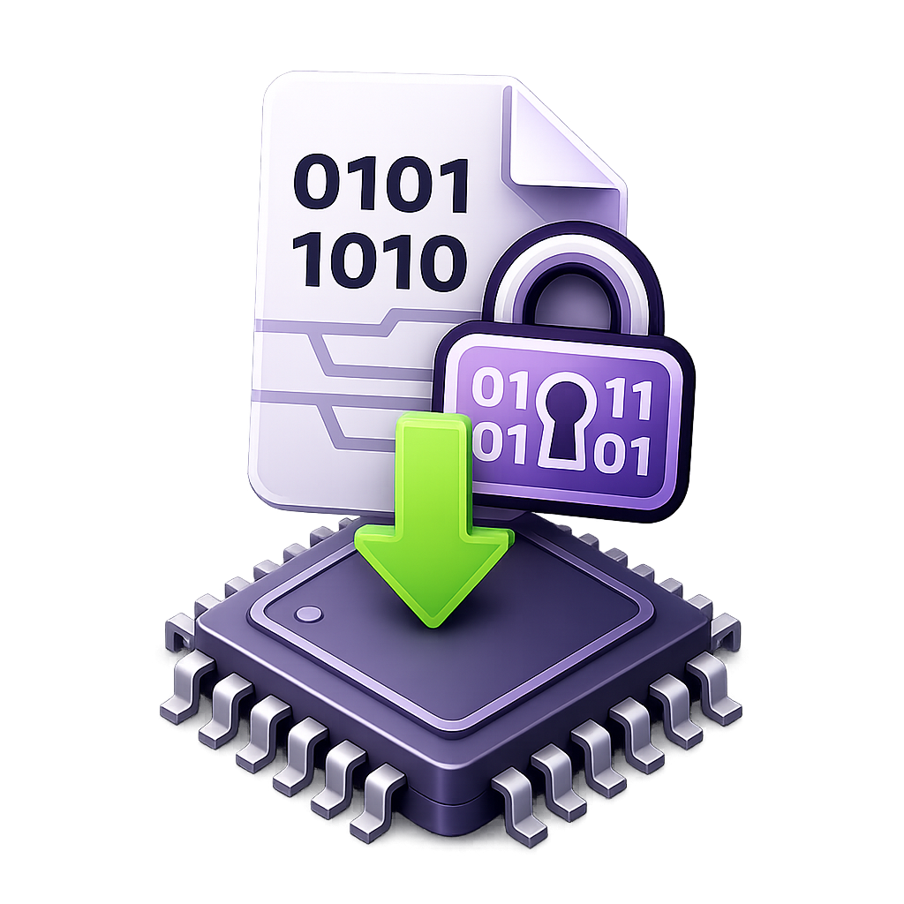
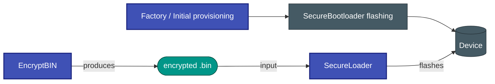
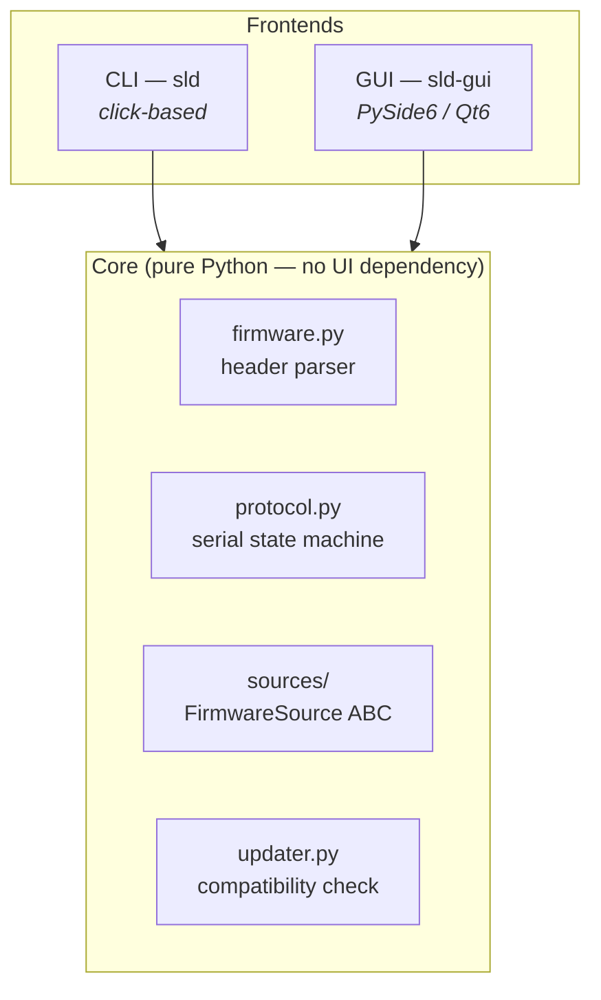

# 🔐 SecureLoader


<table style="width: 100%; border: none;">
  <tr>
    <td style="width: 260px; vertical-align: top;">
      
    </td>
    <td style="vertical-align: top; font-size: 0.9rem; font-family: system-ui, sans-serif; position: relative;">
      <div style="margin-bottom: 1.5em;">
          <strong>SecureLoader</strong> is a cross-platform tool for uploading encrypted firmware binaries
          to embedded devices over a serial link.
          It ships with a scriptable CLI (`sld`) and an optional Qt6 GUI (`sld-gui`).
      </div>
      <div style="text-align: right;">
        <a href="https://github.com/niwciu/SecureLoader/releases">
          
        </a>
      </div>
    </td>
  </tr>
</table>
---

## 🧩 Companion tool — EncryptBIN

Firmware files flashed by SecureLoader are produced by
[**EncryptBIN**](https://github.com/niwciu/EncryptBIN) — a companion tool that takes
a raw binary and outputs an AES-128 CBC encrypted `.bin` with the 48-byte header
SecureLoader expects.



---

## ✨ Key Features

- **🔒 Encrypted firmware format** — 48-byte little-endian header (protocol version,
  product ID, app version, previous app version, page count, page size, IV, CRC32)
  followed by an AES-128 CBC encrypted payload
  created by [EncryptBIN](https://github.com/niwciu/EncryptBIN).
- **📡 Custom serial bootloader protocol** — byte-stream, XOR-based ACK/NAK handshake,
  automatic reconnect on timeout, configurable baud rate, parity, and stop-bits.
- **📂 Three firmware sources** — local `.bin` file, HTTP server download (`sld fetch` /
  GUI _Fetch from server_), and a GitHub Releases source (scaffold — not yet wired to
  CLI or GUI; see [Roadmap](GITHUB_SOURCE_MIGRATION.md)).
  The HTTP source supports optional Basic Auth and derives the server URL from the
  device's Product ID automatically.
- **⚡ Full-featured CLI** — every capability available from the terminal and scriptable
  in CI pipelines.
- **🖥️ Qt6 GUI** — graphical frontend covering all CLI features with live compatibility
  indicators and progress bars.
- **🌍 Cross-platform** — Linux, Windows, macOS (Python 3.10+, pyserial, PySide6).
- **🗣️ Runtime i18n** — language switch without restart (English, German, French,
  Spanish, Italian, Polish).

---

## 🏗️ Architecture at a Glance



The strict layering rule — **core never imports from CLI or GUI** — keeps the
protocol and firmware logic independently testable and reusable.

---

## 🚀 Quick Start

```bash
# Install CLI + GUI
pip install -e ".[gui]"

# Verify
sld --version
sld-gui &
```

Flash a firmware file:

```bash
sld flash --file firmware.bin --port /dev/ttyUSB0
```

See the [User Guide](USER_GUIDE.md) for full installation options and a
step-by-step walkthrough.

---

## 📚 Documentation Map

| Page | Contents |
|------|----------|
| [User Guide](USER_GUIDE.md) | Installation, CLI reference, GUI walkthrough, configuration |
| [Firmware Format](FIRMWARE_FORMAT.md) | Binary header layout, field semantics, wire vs. disk format |
| [Serial Protocol](PROTOCOL.md) | Command set, timing, state machine, bootloader requirements |
| [Architecture](ARCHITECTURE.md) | Layer design, module responsibilities, threading model |
| [Contributing](CONTRIBUTING.md) | Dev setup, testing, code style, adding sources / languages |
| [Troubleshooting](TROUBLESHOOTING.md) | Common errors and fixes |
| [Roadmap](GITHUB_SOURCE_MIGRATION.md) | GitHub Releases migration plan |

---

## 📄 License

MIT — see [LICENSE](https://github.com/niwciu/SecureLoader/blob/main/LICENSE).
